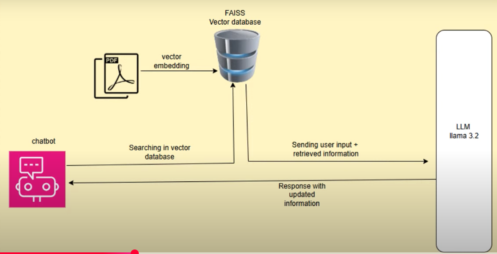

Architecture

 "Wait! Before you jump into the good stuff, take a second to appreciate the countless hours (and cups of coffee) poured into creating this content. Show some love by smashing that subscribe button! 🙌 It’s the easiest way to support all the hard work—plus, you'll never miss the next epic drop! 😄🚀"

https://www.youtube.com/@codersbranch2585

Implementation Steps

Step 1 :  Setting Up LLaMA with Ollama

1 . Install Ollama on your respective OS.
            Check out the platform https://ollama.com/download  to download ollama
    Once installed , Make sure its up and running
           
2. Install Llama 3.2 Model
Once you have Ollama installed, you need to download the Llama 3.2 model for your chatbot. Run the following command:

ollama pull llama3.2

Run the command using terminal
This command will download the Llama 3.2 model to your system, making it ready for local use.

Step 2: Installing Required Libraries

               Set up virtual environment  (  Optional )

Run the below command to install the libraries

pip install streamlit PyPDF2 langchain sentence-transformers faiss-cpu ollama

If you have a GPU and want to utilize it, use faiss-gpu instead. ( optional)

pip install -U langchain-community

Step 3: Writing the Code

  Create a file called app.py  and add the below code

import streamlit as st
import os
from PyPDF2 import PdfReader
from langchain.embeddings import HuggingFaceEmbeddings
from langchain.vectorstores import FAISS
from langchain.text_splitter import RecursiveCharacterTextSplitter
from langchain.chains import RetrievalQA
from langchain.llms import Ollama
from langchain.chains.question_answering import load_qa_chain

# Function to extract text from PDF
def extract_text_from_pdf(pdf_path):
    reader = PdfReader(pdf_path)
    text = ""
    for page in reader.pages:
        text += page.extract_text()
    return text

# Function to create FAISS vector store
def create_faiss_vector_store(text, path="faiss_index"):
    splitter = RecursiveCharacterTextSplitter(chunk_size=1000, chunk_overlap=200)
    chunks = splitter.split_text(text)

    embeddings = HuggingFaceEmbeddings(model_name="sentence-transformers/all-MiniLM-L6-v2")
    vector_store = FAISS.from_texts(chunks, embedding=embeddings)
    vector_store.save_local(path)

# Load FAISS vector store
def load_faiss_vector_store(path="faiss_index"):
    embeddings = HuggingFaceEmbeddings(model_name="sentence-transformers/all-MiniLM-L6-v2")
    vector_store = FAISS.load_local(path, embeddings,  
                 allow_dangerous_deserialization=True)
    return vector_store

# Build QA Chain
def build_qa_chain(vector_store_path="faiss_index"):
    vector_store = load_faiss_vector_store(vector_store_path)
    retriever = vector_store.as_retriever()
    # Load QA chain for combining documents
    llm = Ollama(model="llama3.2")
    qa_chain = load_qa_chain(llm, chain_type="stuff")
    qa_chain = RetrievalQA(retriever=retriever,combine_documents_chain=qa_chain)
    return qa_chain

# Streamlit App
st.title("RAG Chatbot with FAISS and LLaMA")
st.write("Upload a PDF and ask questions based on its content.")

uploaded_file = st.file_uploader("Upload your PDF file", type="pdf")

if uploaded_file is not None:
    pdf_path = f"uploaded/{uploaded_file.name}"
    os.makedirs("uploaded", exist_ok=True)

    with open(pdf_path, "wb") as f:
        f.write(uploaded_file.getbuffer())

    text = extract_text_from_pdf(pdf_path)

    st.info("Creating FAISS vector store...")
    create_faiss_vector_store(text)

    st.info("Initializing chatbot...")
    qa_chain = build_qa_chain()
    st.success("Chatbot is ready!")

if 'qa_chain' in locals():
    question = st.text_input("Ask a question about the uploaded PDF:")
    if question:
        st.info("Querying the document...")
        answer = qa_chain.run(question)
        st.success(f"Answer: {answer}")

Finally run the command

         streamlit run app.py

This launches the chatbot on localhost:8501.

